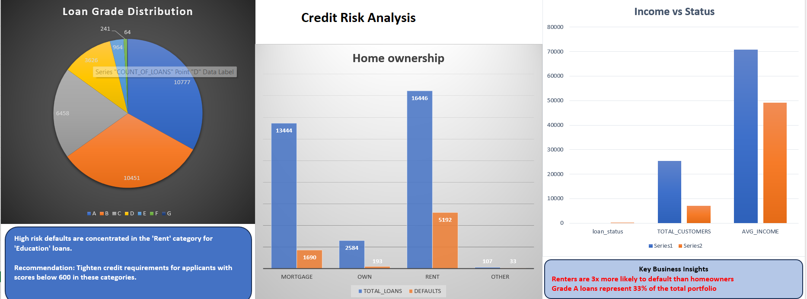

# Credit_Risk_Analysis

##  Project Overview
This project analyzes bank loan data to identify default patterns. I used **SQL Server** for data extraction and **Microsoft Excel** to create an interactive dashboard.

## 📊 Dashboard Preview

##  Key Technical Steps
* **SQL:** Performed aggregations to find default rates by income and home ownership.
* **Excel:** Built a professional dashboard using Pie, Column, and Bar charts.
* **Insights:** Identified that renters have a higher risk profile than homeowners in this dataset.

##  Files
* `Credit_Risk_Analysis.xlsx` - Interactive Dashboard
* `Credit_Risk_Queries.sql` - SQL Scripts
*
